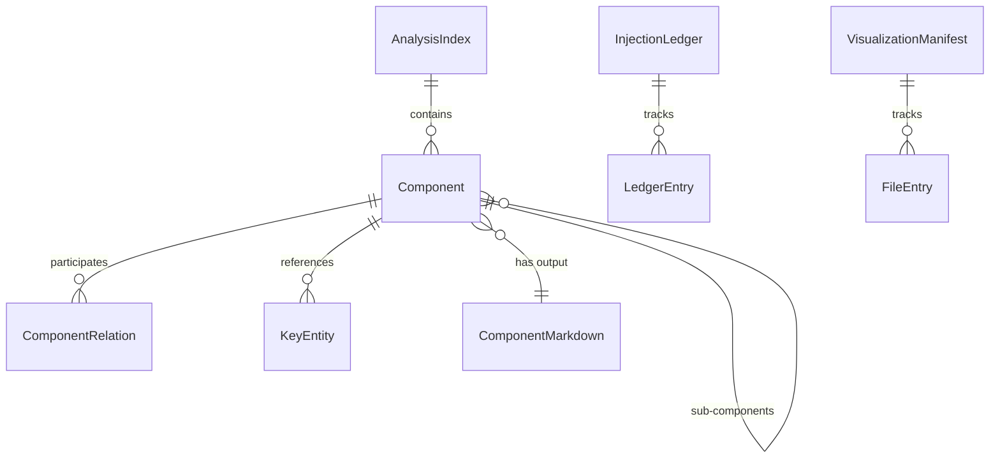

# Data Model: CodeBoarding Visualization

**Feature**: `003-codeboarding-viz`  
**Date**: 2026-03-04  
**Source**: [spec.md](spec.md), [research.md](research.md)

---

## Entity Diagram



---

## Entities

### 1. AnalysisIndex

**Source**: `.codeboarding/analysis.json` (produced by CodeBoarding CLI)  
**Ownership**: Read-only — produced by CodeBoarding, consumed by dev-stack  
**Purpose**: Authoritative index of all components, their hierarchy, and relationships.

| Field | Type | Description |
|-------|------|-------------|
| `metadata.generated_at` | `str` (ISO-8601) | Timestamp of analysis run |
| `metadata.repo_name` | `str` | Repository name |
| `metadata.depth_level` | `int` | Depth level used for this analysis |
| `metadata.file_coverage_summary` | `object` | File coverage statistics |
| `description` | `str` | Repository-level architecture description |
| `components` | `list[Component]` | Top-level components |
| `components_relations` | `list[ComponentRelation]` | Top-level inter-component relations |

**Validation rules**:
- `components` must be a non-empty list for a successful parse
- `metadata.depth_level` must be a positive integer
- If `components` is empty, the parser reports "no components found" (edge case)

---

### 2. Component

**Source**: Nested within `AnalysisIndex.components` (recursive)  
**Ownership**: Read-only  
**Purpose**: Represents an architectural component identified by CodeBoarding.

| Field | Type | Description |
|-------|------|-------------|
| `name` | `str` | Human-readable component name (e.g., `"LLM Agent Core"`) |
| `description` | `str` | Component description |
| `key_entities` | `list[KeyEntity]` | Important code entities in this component |
| `assigned_files` | `list[str]` | Repository-relative file paths assigned to this component |
| `source_cluster_ids` | `list[int]` | Internal clustering identifiers |
| `component_id` | `str` | 16-char hex unique identifier |
| `can_expand` | `bool` | Whether this component has sub-components |
| `components` | `list[Component]` | Sub-components (present at depth > 1) |
| `components_relations` | `list[ComponentRelation]` | Relations between sub-components |

**Derived properties**:
- `markdown_filename`: Component `name` with non-alphanumeric chars (spaces, `&`, etc.) replaced by underscores + `.md`  
  Example: `"Application Orchestrator & Repository Manager"` → `"Application_Orchestrator_Repository_Manager.md"`
- `target_folder`: Longest common directory prefix of `assigned_files`  
  Example: `["agents/agent.py", "agents/constants.py"]` → `"agents/"`

**Validation rules**:
- `name` must be non-empty
- `component_id` must be a 16-char hex string
- `assigned_files` may be empty (component with no direct file assignments)

---

### 3. ComponentRelation

**Source**: Within `components_relations` arrays at any level  
**Ownership**: Read-only  
**Purpose**: Describes a directed relationship between two components.

| Field | Type | Description |
|-------|------|-------------|
| `relation` | `str` | Verb phrase describing the relationship |
| `src_name` | `str` | Source component name |
| `dst_name` | `str` | Destination component name |
| `src_id` | `str` | Source component_id (hex) |
| `dst_id` | `str` | Destination component_id (hex) |

---

### 4. KeyEntity

**Source**: Within `Component.key_entities`  
**Ownership**: Read-only  
**Purpose**: References a significant code entity (class, function) within a component.

| Field | Type | Description |
|-------|------|-------------|
| `qualified_name` | `str` | Fully qualified name (e.g., `"agents.agent.CodeBoardingAgent"`) |
| `reference_file` | `str` | Repository-relative file path |
| `reference_start_line` | `int \| None` | Optional start line |
| `reference_end_line` | `int \| None` | Optional end line |

---

### 5. ComponentMarkdown

**Source**: `.codeboarding/<Component_Filename>.md` (produced by CodeBoarding CLI)  
**Ownership**: Read-only  
**Purpose**: Contains the pre-rendered Mermaid diagram and description for a component.

| Field | Type | Description |
|-------|------|-------------|
| `file_path` | `Path` | Path to the `.md` file within `.codeboarding/` |
| `mermaid_block` | `str` | Extracted Mermaid code block content (between ` ```mermaid ` and ` ``` `) |
| `details_section` | `str \| None` | Optional `## Details` section content |

**Extraction rule**: Parse the first ` ```mermaid ... ``` ` fenced code block from the file.

---

### 6. InjectionLedger

**Source**: `.codeboarding/injected-readmes.json` (managed by dev-stack)  
**Ownership**: Read-write — created and maintained by dev-stack  
**Purpose**: Tracks all README files that have received managed section injections for cleanup during uninstall.

| Field | Type | Description |
|-------|------|-------------|
| `version` | `int` | Schema version (currently `1`) |
| `generated_at` | `str` (ISO-8601) | Timestamp of last update |
| `entries` | `list[LedgerEntry]` | List of injection records |

**File location**: `.codeboarding/injected-readmes.json`

**Example**:
```json
{
  "version": 1,
  "generated_at": "2026-03-04T12:00:00Z",
  "entries": [
    {
      "readme_path": "README.md",
      "marker_id": "architecture",
      "component_name": null
    },
    {
      "readme_path": "agents/README.md",
      "marker_id": "component-architecture",
      "component_name": "LLM Agent Core"
    }
  ]
}
```

---

### 7. LedgerEntry

**Source**: Within `InjectionLedger.entries`  
**Ownership**: Read-write  
**Purpose**: A single record of a README injection.

| Field | Type | Description |
|-------|------|-------------|
| `readme_path` | `str` | Repository-relative path to the README file |
| `marker_id` | `str` | Managed section marker ID (`"architecture"` or `"component-architecture"`) |
| `component_name` | `str \| None` | Component name (`null` for root architecture diagram) |

---

### 8. VisualizationManifest (existing — modified)

**Source**: `.dev-stack/viz/manifest.json` (managed by dev-stack)  
**Ownership**: Read-write — used for change detection gating  
**Purpose**: Hash-based file manifest for determining whether CodeBoarding needs to be re-invoked.

| Field | Type | Description |
|-------|------|-------------|
| `generated_at` | `str \| None` (ISO-8601) | Timestamp of last manifest build |
| `files` | `dict[str, FileEntry]` | Map of repo-relative path → file entry |

*This entity already exists in `src/dev_stack/visualization/incremental.py`. It is retained as-is for the change detection gate in incremental mode.*

---

### 9. FileEntry (existing — unchanged)

**Source**: Within `VisualizationManifest.files`  
**Ownership**: Read-write  
**Purpose**: Hash and metadata for a single tracked file.

| Field | Type | Description |
|-------|------|-------------|
| `hash` | `str` | Content hash of the file |
| `lines` | `int` | Line count |

---

## State Transitions

### Visualization Run Lifecycle

```
[No Output] --(dev-stack visualize)--> [CodeBoarding Running]
    --> [Output Produced] --(parse analysis.json)--> [Diagrams Extracted]
    --> [README Injection] --(write managed sections)--> [Ledger Updated]
    --> [Complete]
```

### Error States

```
[CodeBoarding Running] --(non-zero exit)--> [Error: stderr displayed, no README changes]
[CodeBoarding Running] --(timeout)--> [Error: timeout message, no README changes]
[Output Produced] --(missing/malformed analysis.json)--> [Error: parse failure logged]
[Diagrams Extracted] --(missing .md file for component)--> [Warning: skip that component]
```

### Module Lifecycle

```
[Not Installed] --(install())--> [Installed: .codeboarding/ dir created, CLI verified]
[Installed] --(verify())--> [Healthy | Unhealthy]
[Installed] --(visualize)--> [Diagrams injected, ledger updated]
[Installed] --(uninstall())--> [Cleaned: dirs removed, managed sections removed via ledger]
[Installed] --(update())--> [Re-verified: CLI check refreshed]
```

---

## Directory Layout

```
<repo-root>/
├── .codeboarding/                    # CodeBoarding output directory
│   ├── analysis.json                 # Authoritative component index (READ)
│   ├── analysis.json.lock            # Lock file (IGNORE)
│   ├── analysis_manifest.json        # Analysis metadata (IGNORE)
│   ├── overview.md                   # Top-level Mermaid diagram (READ)
│   ├── <Component_Name>.md           # Per-component diagrams (READ)
│   ├── injected-readmes.json         # Injection ledger (READ-WRITE, dev-stack owned)
│   ├── annotations.json              # (IGNORE)
│   ├── codeboarding_version.json     # (IGNORE)
│   ├── file_coverage.json            # (IGNORE)
│   └── health/                       # (IGNORE)
├── .dev-stack/viz/
│   ├── manifest.json                 # File change manifest (READ-WRITE, existing)
│   └── overview.json                 # Schema cache (READ-WRITE, existing — may be deprecated)
├── README.md                         # Root architecture diagram injection target
└── <component-folder>/
    └── README.md                     # Component sub-diagram injection target
```
